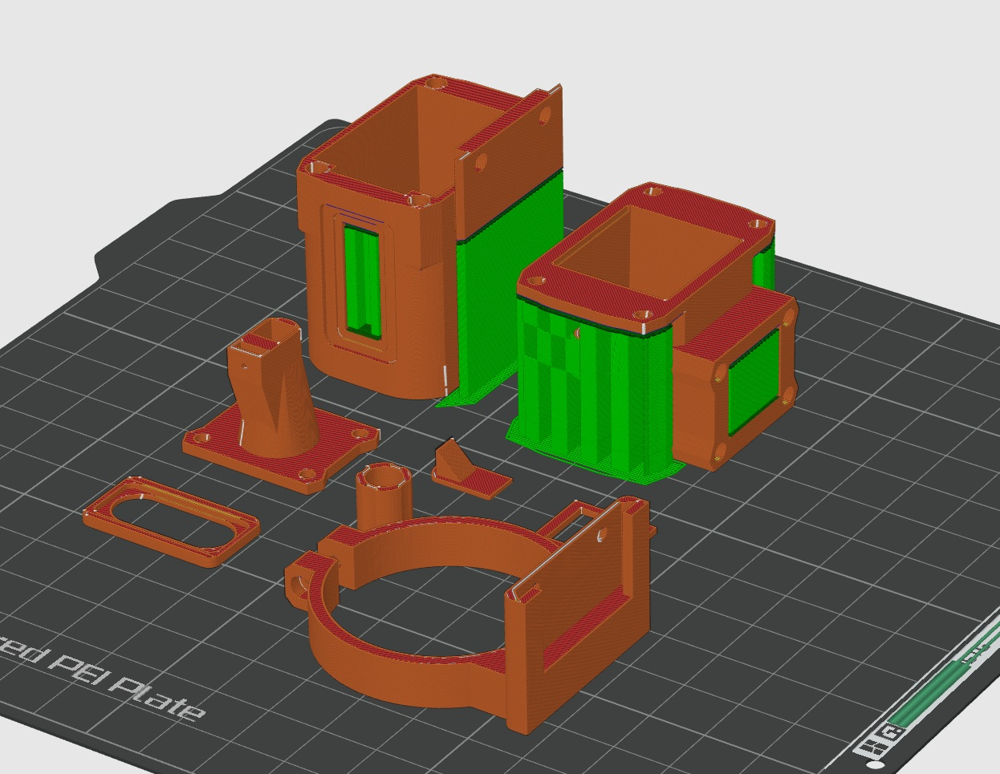
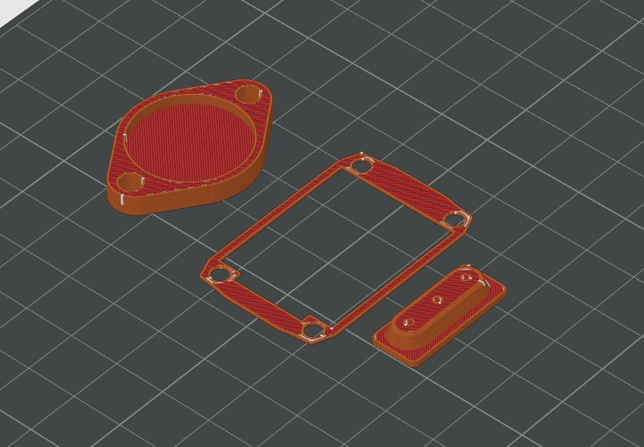
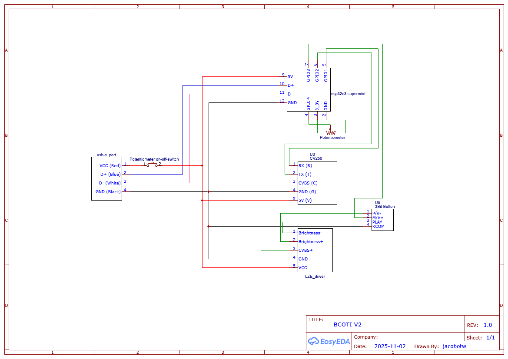

# BCOTI (Budget-Clip-On-Thermal-Imager)
This project is about building a Clip-On-Thermal-Imager (COTI) for Analog night vision goggles, similar to the Jerry-C, PAS29A/B, etc. yourself.

The current version uses a 256x192@12um sensor with a 9.1mm lens. This combined with the LZE039 and 25mm DCX lens, gives you a 1x 17°x13° thermal overlay in your NVGs.

Cropping it to a 13° circle is also an option by modifying the shape of the `Display_Spacer.step` model.

The unit is powered by a standard USB-C power source delivering 5v.

# User Manual

## Powering the unit
BCOTI by default needs a 5v USB-C power source. The cable you use must be USB-A to USB-C.

## Attaching it to an NV device
You'll need a mounting-adapter that fits your specific device, which then mounted on the rail of the BCOTI. The most common style mounts via a clamp right behind the front lens.

ensure that the BCOTI sits straight in front of your front lens, not doing so will cause the overlay not to be centred in the IIT view.

## Setting the brightness
1. Which the unit attached to your NV device, turn it on
2. Turn the knob on the back to the lowest brightness position.
3. Set the display brightness to a level where the rectangle shape of the display is not just about not visible anymore, using the outer two buttons on the side of the unit.
4. Now turn up the knob on the back to the desired threshold level.

Setting the brightness may need to be done again if lighting conditions change.

## Switching modes.
By default, the unit will have three modes
- Outline
- Highlight (Outdoor)
- Highlight (Indoor)

To cycle through them, press the middle button on the side of the unit.

## Configuring new modes.

The BCOTI uses the Wi-Fi interface of the esp32 board to act as a web server to host a basic WebUI. To start the unit with Wi-Fi enabled, 

1. Insure the knob on the back is in the off-position.

2. Start holding down the middle button

3. Turn the knob on the back to the on-position

4. Continue holding the middle button for about 5s, then let go.

5. Open your phones Wi-Fi settings and connect to "BCOTI", the password is "wifipass1234"

6. Once connected Inside a web browser, open "192.168.4.1".

7. At the top you select the active preset, that the unit is showing, and to which you make changes.

8. In order for a preset to be available to be selected via the button, it must be active.

9. Once you made all your changes, reboot the unit to run it on the normal mode. Then use the push button to cycle through your active presets.

* If the local webpage won't load, try disabling your mobile-data, this is an issue with some OS that won't actually try and use the Wi-Fi network because it does not provide an internet connection. On IPhone this usually isn't an issue.

## Side effect "features"
Because of BCOTIs off-the-shelf parts nature, there are some features that might be confusing or annoying.

### Image orientation
Recent orders for the display, and those from the US-group-buy include a display driver which has the ability to mirror the image. This allows for digital alignment of the overlay, to make it easier to perfectly line up with your IIT image. 

Switching the image orientation of the driver is done via the brightness+ button. 

- Holding down the button for about 4s while the unit is on, will mirror on the X-Axis.

- Holding down the button before turning the unit on, and then holding continuing to hold it until you see the orientation change, switches the Y-Axis.

There is no way to lock the image origination, so in case you accidentally change it, you'll need to change it back via the same controls.

### Color modes.
The display driver has three colors modes, intended for standalone units. The modes are:

- Full-color
- Green
- Blue

To cycle through them, hold down the brightness- button for about 4s. For the BCOTI you always want to use the full-color mode (combined with WHOT from the camera module), as the other two modes also color in the background, instead of leaving it black.

# Bill-of-materials
Expect to pay about 400€ (EU) or about 500usd (US) for parts when buying in small quantities

If you do end up buying these parts, and are happy with the end result, I'd appreciate it if you supported my future work on this and similar projects via my [BuyMeACoffee page](https://buymeacoffee.com/jacob_otw)

Some of the links are affiliate links, which means I make a small commission on your purchase, at no added cost to you.

| Part                           | Cost   | Link                                                                                                    | Comment                                                                                                                                                                                                                                                                                                                                                                                                                                            |
|--------------------------------|--------|---------------------------------------------------------------------------------------------------------|----------------------------------------------------------------------------------------------------------------------------------------------------------------------------------------------------------------------------------------------------------------------------------------------------------------------------------------------------------------------------------------------------------------------------------------------------|
| Mini2                          | 189€   | [AliExpress (256 9.1mm option)](https://s.click.aliexpress.com/e/_ooB5Db9)                              | Only the 256 w/ 9.1mm version will work, others won't be 1x with current setup. [Hdaniee Store page incase the link doesn't work](https://www.aliexpress.com/store/1104212749?spm=a2g0o.detail.0.0.5c38Uf2FUf2Fd3), CV256 9.1mm. [For Some it might also be much cheaper to buy on Alibaba](https://www.alibaba.com/product-detail/HDANIEE-Series-Thermal-Imaging-Camera-Module_1601290252342.html?spm=a27aq.27095423.1978240560.1.78372277Z3cl82) |
| LZE039 OLED                    | 98€    | [AliExpress (AV 3color option)](https://s.click.aliexpress.com/e/_oCvDQUx)                              | Bare screen + AV driver.                                                                                                                                                                                                                                                                                                                                                                                                                           |
| Esp32c3 Super Mini             | 2.6€   | [AliExpress](https://s.click.aliexpress.com/e/_oCkdBST)                                                 | They can break during assembly, I'd recommend a 5pc for safety.                                                                                                                                                                                                                                                                                                                                                                                    |
| USB-C Connector Breakout (1x+) | 2.25€  | [AliExpress 2pc ("TYPE-C male 4P" option)](https://s.click.aliexpress.com/e/_oCcvkCx)                   | At least 1x for device internal, but can also be used to created really low profile cable for helmet setup.                                                                                                                                                                                                                                                                                                                                        |
| USB-C Port                     | 1.49€  | [AliExpress ("4P Black" option)](https://www.aliexpress.us/item/1005005768848819.html)                  |                                                                                                                                                                                                                                                                                                                                                                                                                                                    |
| Row of buttons                 | 1.19€  | [AliExpress ("3 bit" option)](https://s.click.aliexpress.com/e/_c3XvcmrD)                               |                                                                                                                                                                                                                                                                                                                                                                                                                                                    |
| Poti w/ ON-OFF-switch          | 2.59€  | [AliExpress 5pc ("20K Ohm" option)](https://s.click.aliexpress.com/e/_omefAub)                          | Can also be higher resistance value, for voltage divider, without current draw like here, it doesn't really matter                                                                                                                                                                                                                                                                                                                                 |
| M2x4 Screws (10x)              | 1.35€  | [AliExpress 50pc (M2 x 50pc, 4mm length option)](https://www.aliexpress.us/item/1005008314123679.html)  |                                                                                                                                                                                                                                                                                                                                                                                                                                                    |
| M2x12 Screws (4x)              | 1.35€  | [AliExpress 50pc (M2 x 50pc, 12mm length option)](https://www.aliexpress.us/item/1005008314123679.html) |                                                                                                                                                                                                                                                                                                                                                                                                                                                    |
| M2x3 Heat Inserts (14x)        | 9.99€  | [CNCKitchen 100pc](https://cnckitchen.store/products/heat-set-insert-m2-x-3-100-pieces)                 | Could also get cheaper ones in similar size, but I like these because they give good info about the required hole sizes. Should you get one with a smaller OD, the FreeCad file has a parameter for that.                                                                                                                                                                                                                                          |
| 5mmD 25mmF DCX lens            | 41.61$ | [USA Source](https://partkits.com/products/5mm-x-25mm-efl-lens)                                         | Can also be bought from [Edmund Optics](https://www.edmundoptics.com/p/5mm-dia-x-25mm-fl-uncoated-double-convex-lens/18171/) or [OptoSigma](https://www.optosigma.com/eu_de/catalog/product/view/id/41346/s/biconvex-lens-5mm-diameter-25-2mm-focal-length-uncoated/category/23/) both can have fairly long lead times though. If you're outside the US, especially in the EU, send me an email, and I'll help you find one                        |
| 5x5x5mm right-angle-prism      | 1.99€  | [AliExpress](https://s.click.aliexpress.com/e/_oBrJOrZ)                                                 | [If the link doesn't work, try this one](https://www.aliexpress.com/item/4001089104491.html)                                                                                                                                                                                                                                                                                                                                                       |
| 3mm Elastic band (1m)          | 1,99€  | [AliExpress ("3mm 10meters" option)](https://s.click.aliexpress.com/e/_oCvMedl)                         | should be between 2mm and 3mm thickness, you won't actually need a meter, but cutting them to the right sizes sometimes takes a few tries.                                                                                                                                                                                                                                                                                                         |
| 26AWG Silicone wire            | 10.29€ | [AliExpress ("26 AWG 60m" option)](https://s.click.aliexpress.com/e/_oFwRszV)                           | Any 26AWG (or close to) silicone wire will work, would recommend least 3 unique colors though.                                                                                                                                                                                                                                                                                                                                                     |
| 1.25mm 5pin jst cable          | 2.69€  | [AliExpress ("5set 5pin" option)](https://s.click.aliexpress.com/e/_olXJtVt)                            |                                                                                                                                                                                                                                                                                                                                                                                                                                                    |
| Heat shrink tubes              | 1.69€  | [AliExpress ("127pcs black Bagged" option)](https://s.click.aliexpress.com/e/_c3RdV28F)                 |                                                                                                                                                                                                                                                                                                                                                                                                                                                    |

# Build-Guide

## (Still outdated) Build Guide Video

A full video guide is also available, but I'd recommend have the written instructions open as well, as any comments or changes will be made there.

### Important Notes
- The momentary push button is now connected to GPIO8 (was GPIO21)

## 3d printed parts

If you're going to have these parts MJF printed (not recommended during beta), then feel free to use my [JLC3DP referral code](https://jlc3dp.com/?from=jacobotw)

1. Print the following parts
    - `Back_Body.step`
    - `x_Lens_Front_Body.step` (Print the one appropriate for the type of lens on your camera module)
    - `Display_Spacer.step`
    - `Zoomed_Periscope.step` (if you have an older display driver, check the legacy folder for infos!)
    - `Periscope_Cover.step`
    - `Side_Cover.step`
    - `Knob_Cover.step`
    - Mounting ring for your specific NV unit (Found in the `CAD_Files/MountingClips` folder)

    as shown in the image below.
    
    Change the following
    1. Wall-loops to 3x
    2. Infill to about 22% to 35%

    
     

    Only the Front and Back part will necessarily need supports. You may want to manually add them via the slicer, even if the printed thinks it can bridge them.

2. Print the following parts out of a fairly flexible TPU (I used 95A from Overture)
    - `TPU_Gasket.step`
    - `TPU_Lens_Cover.step`
    - `TPU_Button_Cover.step`
    Like shown in the image below

    
     
    Add supports to `TPU_Button_Cover.step`, I used Snug supports. 

## Electronics

### Step-by-step

Using Heat shrink for all connections where possible is recommended.

## Assembly

